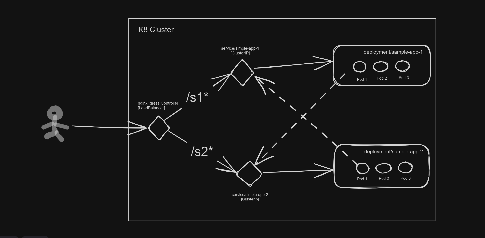


# Dotnet-Kubernetes Demo application 





## Docker Image Build:

Run the following command from the root solution directory `\ContainerOrchestrationSln`.
```shell
docker build . -f .\ContainerOrchestration.Api\Dockerfile -t kparavindbabu/simple-dotnet-api:1.0.0
```

```shell
docker push kparavindbabu/simple-dotnet-api:1.0.0
```

https://hub.docker.com/repository/docker/kparavindbabu/simple-dotnet-api/general

## Deploy to Kubernetes Cluster:

Navigate to this file path `cd ContainerOrchestrationSln\Infra\K8s`

1. Deploy Pods
    
    ```shell
    kubectl apply -f .\sample-app-deploy.yaml
    ```

2. Deploy Service
    
    ```shell
    kubectl apply -f .\sample-app-service.yaml
    ```

3. Install nginx Ingress controller
    
   Use the local copy
    ```shell
    kubectl apply -f nginx-ingress-v1_6_4-deploy.yaml
    ```
   Or apply directly from the GitHub
   ```shell
   kubectl apply -f https://raw.githubusercontent.com/kubernetes/ingress-nginx/controller-v1.6.4/deploy/static/provider/cloud/deploy.yaml
   ```

4. Deploy Ingress Controller
    
    ```shell
    kubectl apply -f .\sample-app-ingress.yaml
    ```

5. Attach interactive terminal to running a pod for debugging
    
    ```shell
    kubectl exec pod/sample-app -i -t -- /bin/bash
    ```


## Endpoints:

- To access `service-1` endpoints prefix `s1` on the request as shown below:
  - http://localhost/s1/WeatherForecast
  - http://localhost/s1/WeatherForecast/MachineInfo
  - http://localhost/s1/WeatherForecast/CallInternalService (Internally calls http://localhost/s2/WeatherForecast/CallInternalService)

- To access `service-2` endpoints prefix `s2` on the request as shown below:
   - http://localhost/s2/WeatherForecast
   - http://localhost/s2/WeatherForecast/MachineInfo
   - http://localhost/s2/WeatherForecast/CallInternalService  (Internally calls http://localhost/s1/WeatherForecast/CallInternalService)
   

## Cleanup:

```shell
kubectl delete -f sample-app-ingress.yaml
```

```shell
kubectl delete -f sample-app-service.yaml
```

```shell
kubectl delete -f sample-app-deploy.yaml
```
